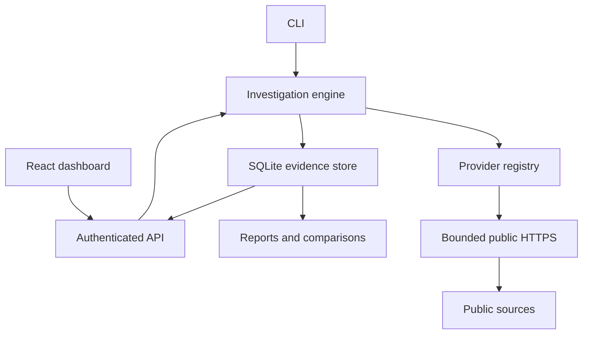

# Architecture

SocialIntel has one collection engine. The CLI invokes it directly; the dashboard talks to the authenticated FastAPI service, which invokes that same engine. Results are persisted in local SQLite through SQLAlchemy.

## Pipeline

1. Validate a target, platform, and bounded request before creating a job.
2. Try the selected provider unless full discovery was requested.
3. In fallback mode, broaden only when the selected provider did not return FOUND. Search configured adapters, never a fabricated result for each catalog name.
4. Optionally use a configured public search API. Store snippets as unverified references; verify compatible profile URLs separately through their adapters.
5. Optionally follow declared public links and collect supported public posts within depth, page, candidate, platform, request, and time limits.
6. Persist attributed source observations, build graph/timeline views, and compute labeled heuristic correlations.
7. Record a terminal status, including cancellation or interruption, retaining completed evidence.

The process permits two executing investigations, eight queued/running jobs, and four simultaneous outbound requests. Defaults are 40 requests, 20 candidates, eight platforms, five HTML pages, one link depth, 90 seconds, and ten posts when enabled. Hard upper bounds are in `models.Limits`; settings/UI expose the same defaults.

## State and semantics

Provider manifests describe implementation/readiness; configuration means required variables are present. Health records describe the last observed request and timestamp. No silent availability probes or background surveillance run. Cache hits last 15 minutes and retain original collection timestamps. `--refresh` skips cache, but cannot bypass cooldowns.

Case metadata is editable. Evidence observations retain immutable payloads and SHA-256 digests. Digests detect an altered payload relative to its stored checksum; they are not signatures, trusted timestamps, a blockchain, or protection against an attacker rewriting both payload and checksum. Uploaded screenshots remain unverified bytes and are downloaded separately from reports.

Manual comparisons identify changes among observed fields. A profile missing from one run is labeled not observed, not deleted. Correlation HIGH/MEDIUM/LOW describes signal strength, not an identity probability. Counts represent observations across runs rather than unique people.

## Operational limits

The queue is in memory. Startup marks unfinished database jobs interrupted; collection must be rerun manually. Use one worker. SQLite is the only implemented database; PostgreSQL, distributed workers, RBAC, and multi-tenant isolation are future work, not hidden supported features. Case deletion is logical; backups and disk snapshots may retain earlier data.
